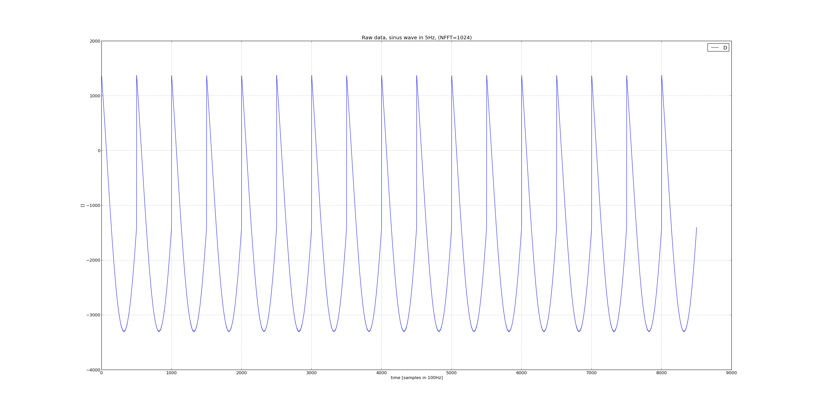

e3-ecmcPlugin_Scope
======
ESS Site-specific EPICS module : ecmcPlugin_Scope

A shared library with Scope functionalities loadable into ecmc:

https://github.com/epics-modules/ecmc (or local ess fork https://github.com/icshwi/ecmc).

Configuration is made through ecmccfg:

https://github.com/paulscherrerinstitute/ecmccfg (ot local ess fork https://github.com/icshwi/ecmccfg)


# Introduction

The main functionality of this plugin is triggerd sampling of ethercat data from oversampled and timestamped ethercat slaves, like:

Data:
* EL3702
* EL3742
* EL5101-0011
* ELM3604
* ....

Trigger:
* EL1252
* EL1252-0050

## Loading of Scope plugin in ecmc: 

NOTE: "require" can be used to get access to the template file. However, the plugin also needs to be loaded like below.

A plugin is loaded by the ecmccfg command loadPlugin:
https://github.com/icshwi/ecmccfg/blob/master/scripts/loadPlugin.cmd

Example:
```
epicsEnvSet(RESULT_NELM, 1024)
epicsEnvSet(ECMC_PLUGIN_FILNAME,"/home/pi/sources/e3-ecmcPlugin_Scope/ecmcPlugin_Scope-loc/O.7.0.4_linux-arm/libecmcPlugin_Scope.so")
epicsEnvSet(ECMC_PLUGIN_CONFIG,"SOURCE=ec0.s${SLAVE_NUM_AI}.mm.CH1_ARRAY;DBG_PRINT=1;TRIGG=ec0.s${SLAVE_NUM_TRIGG}.CH1_LATCH_POS;SOURCE_NEXTTIME=ec0.s${SLAVE_NUM_AI}.NEXT_TIME;RESULT_ELEMENTS=${RESULT_NELM};")
${SCRIPTEXEC} ${ecmccfg_DIR}loadPlugin.cmd, "PLUGIN_ID=1,FILE=${ECMC_PLUGIN_FILNAME},CONFIG='${ECMC_PLUGIN_CONFIG}', REPORT=1"
epicsEnvUnset(ECMC_PLUGIN_FILNAME)
epicsEnvUnset(ECMC_PLUGIN_CONFIG)
dbLoadRecords("../template/ecmcPluginScope.template","P=$(IOC):,PORT=${ECMC_ASYN_PORT},INDEX=0,RESULT_NELM=${RESULT_NELM},RESULT_DTYP=asynInt16ArrayIn,RESULT_FTVL=SHORT")
epicsEnvUnset(RESULT_NELM, 1024)
```

This plugin supports multiple loading. For each load of the plugin a new Scope object will be created. In order to access these plugins, from plc:s or EPICS records, they can be accessed by an index. The first Scope plugin will have index 0. The next loaded Scope plugin will have index 1...

Note: If another plugin is loaded in between the loading of Scope plugins, it will have no affect on these Scope indexes (so the Scope index is _not_ the same as plugin index).


## Configuration:

Three links to ethercat data needs to be defined:
* Source data
* Source data timestamp
* Trigger timestamp

All these three links needs to be defined in the plugin startup configuration string.

Other configurations that can be made:
* Data elements to collect
* Debug printouts 
* Enable

  
### Source data (mandatory)

The source data should normally be a ecmc memmap.

The source is defined by the "SOURCE" configuration string:
``` 
SOURCE=ec0.s2.mm.CH1_ARRAY;
``` 

### Source data timestamp (mandatory)

In order to know which source data elements that correspond to the trigger value, the oversampled ethercat slaves normally have a pdo that contains the value of the next dc sync time which is the dc timestamp of the next acquired data element.  

The source timestamp is defined by the "SOURCE_NEXTTIME" configuration string:
``` 
SOURCE_NEXTTIME=ec0.s2.NEXT_TIME;
``` 
This timestamp can be either in 32bit or 64bit format. The "NEXT_TIME" is always considered to be later than the trigger timestamp.

### Trigger (mandatory)

The trigger should normally be a timestamped digital input, like EL1252.

The trigger timestamp is defined by the "TRIGG" configuration string:
``` 
TRIGG=ec0.s5.CH1_LATCH_POS;
``` 
This timestamp can be either in 32bit or 64bit format. If 32 bits then "NEXT_TIME" is always considered to be later than the trigger timestamp.

### Data elements to collect (optional)

The number of values to be collected after the trigger is defined by setting the option "RESULT_ELEMENTS" in the configurations string. The default value is 1024 data elements of the same type as the choosen source.
``` 
RESULT_ELEMENTS=2048;
``` 

### Debug printouts (optional)

Debug printouts can be enbaled/disabled by the option DBG_PRINT (defaults to 0)
``` 
DBG_PRINT=1;
``` 

### Enable (optional)

The acuiring of data can be enabled/disabled by the "ENABLE" option (defaults to 1)
``` 
ENABLE=0;
``` 

### Example of complete configuration string
``` 
epicsEnvSet(ECMC_PLUGIN_CONFIG,"SOURCE=ec0.s${SLAVE_NUM_AI}.mm.CH1_ARRAY;DBG_PRINT=1;TRIGG=ec0.s${SLAVE_NUM_TRIGG}.CH1_LATCH_POS;SOURCE_NEXTTIME=ec0.s${SLAVE_NUM_AI}.NEXT_TIME;RESULT_ELEMENTS=${RESULT_NELM};")
``` 

## EPICS records
Each Scope plugin object will create a new asyn parameters.
The reason for a dedicated asynport is to disturb ecmc as little as possible.
The plugin contains a template file, "ecmcPluginScope.template", that will make most information availbe from records:

* Enable                           (rw)
* Data Source                      (ro)
* Trigger source                   (ro)
* Resultdata                       (ro)

The available records from this template file can be listed by the cmd:
```
raspberrypi-15269 > dbgrep *Scope*
IOC_TEST:Plugin-Scope0-MissTriggCntAct
IOC_TEST:Plugin-Scope0-ScanToTriggSamples
IOC_TEST:Plugin-Scope0-TriggCntAct
IOC_TEST:Plugin-Scope0-Enable
IOC_TEST:Plugin-Scope0-DataSource
IOC_TEST:Plugin-Scope0-TriggSource
IOC_TEST:Plugin-Scope0-NextTimeSource
IOC_TEST:Plugin-Scope0-Data-Act
```

## GUI

### ecmcScopeMainGui

A simple pyqt gui is provided to visualize and control the scope ([GUI](tools/ecmcScopeMainGui.py)).
The gui are included in the ecmccomgui repo:
https://github.com/anderssandstrom/ecmccomgui

The tool recives data from the EPICS records by pyepics framework.

Help screen of ecmcScopeMainGui.py
```
$ python ecmcScopeMainGui.py
ecmcScopeMainGui: Plots waveforms of FFT data (updates on Y data callback). 
python ecmcScopeMainGui.py <prefix> <fftId>
<prefix>  : Ioc prefix ('IOC_TEST:')
<scopeId> : Id of scope plugin ('0')
example   : python ecmcScopeMainGui.py 'IOC_TEST:' '0'
Will connect to Pvs: <prefix>Plugin-Scope<scopeId>-*

```
Example: Start ecmcFFMainTGui.py for:
* predix="IOC_TEST:"
* scopePluginId=0 (the first loaded Scope plugin in the ioc)

```
python ecmcScopeMainGui.py 'IOC_TEST:' '0'
```


### Needed packages:
* python 3.5
* epics
* PyQt5
* numpy 
* matplotlib

## Example script
An example script can be found in the iocsh directory of this repo.

The example is based on:
* EL3702 for acquiring analog data with a oversampling factor of 100 (100kHz sampling rate)
* EL1252 for timestamped trigger

The below image shows triggered acquisition in 10Hz of a 100Hz sinus 1Vpp. For each trigger, 500 samples are acquired in 100kHz sample rate and pushed to epics as waveforms (in 10Hz with NELM 500). In total the image shows data from  17 triggers after each other.



## Plugin info

```
Plugin info: 
  Index                = 1
  Name                 = ecmcPlugin_Scope
  Description          = Scope plugin for use with ecmc.
  Option description   = 
    DBG_PRINT=<1/0>    : Enables/disables printouts from plugin, default = disabled.
    SOURCE=<source>    : Ec source variable (example: ec0.s1.mm.CH1_ARRAY).
    RESULT_ELEMENTS=<Result buffer size>        : Data points to collect, default = 4096.
    SOURCE_NEXTTIME=<nexttime>   : Ec next sync time for source (example: ec0.s1.NEXTTIME)
    TRIGG=<trigger>   : Ec trigg time (example: ec0.s2.LATCH_POS).
    ENABLE=<1/0>   : Enable data acq, defaults to enabled.

  Filename             = /home/dev/projects/e3-ecmcPlugin_Scope/ecmcPlugin_Scope-loc/O.7.0.4_linux-x86_64/libecmcPlugin_Scope.so
  Config string        = SOURCE=ec0.s35.mm.CH1_ARRAY;DBG_PRINT=0;TRIGG=ec0.s1.CH1_LATCH_POS;SOURCE_NEXTTIME=ec0.s35.NEXT_TIME;RESULT_ELEMENTS=500;
  Version              = 2
  Interface version    = 65536 (ecmc = 65536)
     max plc funcs     = 64
     max plc func args = 10
     max plc consts    = 64
  Construct func       = @0x7f28a4eca2a0
  Enter realtime func  = @0x7f28a4eca300
  Exit realtime func   = @0x7f28a4eca290
  Realtime func        = @0x7f28a4eca2f0
  Destruct func        = @0x7f28a4eca2c0
  dlhandle             = @0x1883050
  Plc functions:
    funcs[00]:
      Name       = "scope_enable(arg0, arg1);"
      Desc       = scope_enable(index,enable) : Enable/disaable scope[index].
      Arg count  = 2
      func       = @0x7f28a4eca310
  Plc constants:
```

# Troubleshooting

## Missed triggers
The plugin can not handle new triggers before the acquistion from the previous trigger is completed. Therefore the maximum triggering rate depends on the amount of data that should be acquired.
Therfore, in order to handle higher triggering rates, the result element count might need lowering (see above options).

Missed triggers can also be a result of bad syncronized dc clocks. If the dc-clocks are syncing properly the value of "NEXT_TIME" should always be after the trigger value (since NEXT_TIME should occur in the future).
The time between NEXT_TIME and trigger can be diagnosed by the "ScanToTriggSamples" pv like in this example (NELM=100):
```
camonitor IOC_TEST:Plugin-Scope0-ScanToTriggSamples
IOC_TEST:Plugin-Scope0-ScanToTriggSamples 2020-09-30 08:40:20.680888 91
IOC_TEST:Plugin-Scope0-ScanToTriggSamples 2020-09-30 08:40:20.703867 118  
IOC_TEST:Plugin-Scope0-ScanToTriggSamples 2020-09-30 08:40:20.906862 115  
IOC_TEST:Plugin-Scope0-ScanToTriggSamples 2020-09-30 08:40:20.944867 87  
IOC_TEST:Plugin-Scope0-ScanToTriggSamples 2020-09-30 08:40:21.019865 102  
IOC_TEST:Plugin-Scope0-ScanToTriggSamples 2020-09-30 08:40:21.282872 93  
IOC_TEST:Plugin-Scope0-ScanToTriggSamples 2020-09-30 08:40:21.362859 99  
IOC_TEST:Plugin-Scope0-ScanToTriggSamples 2020-09-30 08:40:21.470863 102  
```
The value should always be 0 < value < 2*NELM (NELM = Oversamplefactor or samples per ethercat cycle) which means that the trigger occured up to 2*NELM ago.
If the value is outside these limts the trigger will be rejected. The reason could be badly syncrobized dc-clocks (see below). 

## Slave time syncing

If the dc time syncronization of the slaves is not working properly then the timestamps from both trigger and analog i/o will drift apart resulting in lost triggers and currupted data.
This could be related to that an old version of the etherlab master is installed and needs to be upgraded.

NOTE: The dc clocks in the slaves start to syncronize to the reference clocks as soon as the ioc enter runtime. This procedure can take normally a few seconds but can also take minutes depending on how many slaves in the network. During this startup syncronization phase the dc clock of the trigger and the analog input slaves may be out of sync resulting in acquisition of wrong data.

### Verify dc diagnostics

#### ethercat master command

Check ethercat master dc diagnostics by issueing the "etehrcat master" command (when ecmc-ioc is running):

```
dev@mcag-epics4 ~ $ ethercat master
Master0
  Phase: Operation
  Active: yes
  Slaves: 49
  Ethernet devices:
    Main: c0:3f:d5:66:24:13 (attached)
      Link: UP
      Tx frames:   1419695
      Tx bytes:    553305060
      Rx frames:   1419694
      Rx bytes:    553304557
      Tx errors:   0
      Tx frame rate [1/s]:   1000   1000   1000
      Tx rate [KByte/s]:    498.0  498.0  498.0
      Rx frame rate [1/s]:   1000   1000   1000
      Rx rate [KByte/s]:    498.0  498.0  498.0
    Common:
      Tx frames:   1419695
      Tx bytes:    553305060
      Rx frames:   1419694
      Rx bytes:    553304557
      Lost frames: 0
      Tx frame rate [1/s]:   1000   1000   1000
      Tx rate [KByte/s]:    498.0  498.0  498.0
      Rx frame rate [1/s]:   1000   1000   1000
      Rx rate [KByte/s]:    498.0  498.0  498.0
      Loss rate [1/s]:          0     -0      0
      Frame loss [%]:         0.0   -0.0    0.0
  Distributed clocks:
    Reference clock:   Slave 0
    DC reference time: 654699808777655501
    Application time:  654700465153733449
                       2020-09-29 13:14:25.153733449
```
The last section of the printout lists some dc information of the master. Check teh following: 

* The "Reference clock" should be assigned to a slave.

* The "DC reference time" should have a resonable value.

* The "Application time" should have a resonable value.

#### ethercat slaves command

Check the dc diagnostics for both the triggering and analog input slave bu the ethercat slaves command (when ecmc-ioc is running).

Example: Trigger slave id = 1

```
ev@mcag-epics4 ~ $ ethercat slaves -p1 -v
=== Master 0, Slave 1 ===
Device: Main
State: OP
Flag: +
Identity:
  Vendor Id:       0x00000002
  Product code:    0x04e43052
  Revision number: 0x00150000
  Serial number:   0x00000000
DL information:
  FMMU bit operation: no
  Distributed clocks: yes, 64 bit
  DC system time transmission delay: 140 ns
Port  Type  Link  Loop    Signal  NextSlave  RxTime [ns]  Diff [ns]   NextDc [ns]
   0  EBUS  up    open    yes             0   1224884182           0         140
   1  EBUS  up    open    yes             2   1224891012        6830         154
   2  N/A   down  closed  no              -            -           -           -
   3  N/C   down  closed  no              -            -           -           -
General:
  Group: DigIn
  Image name: TERM_DI
  Order number: EL1252
  Device name: EL1252 2K. Fast Dig. Eingang 24V, 1�s, DC Latch
  Flags:
    Enable SafeOp: no
    Enable notLRW: no
  Current consumption: 110 mA
```

Example: analog input slave id = 35

```
dev@mcag-epics4 ~ $ ethercat slaves -p35 -v
=== Master 0, Slave 35 ===
Device: Main
State: OP
Flag: +
Identity:
  Vendor Id:       0x00000002
  Product code:    0x0e763052
  Revision number: 0x00030000
  Serial number:   0x00000000
DL information:
  FMMU bit operation: no
  Distributed clocks: yes, 32 bit
  DC system time transmission delay: 9088 ns
Port  Type  Link  Loop    Signal  NextSlave  RxTime [ns]  Diff [ns]   NextDc [ns]
   0  EBUS  up    open    yes            34   1765139745           0         170
   1  EBUS  down  closed  no              -            -           -           -
   2  N/A   down  closed  no              -            -           -           -
   3  N/A   down  closed  no              -            -           -           -
General:
  Group: AnaInFast
  Image name: TERM_AI
  Order number: EL3702
  Device name: EL3702 2K. Ana. Eingang +/-10V, DIFF, Oversample
  Flags:
    Enable SafeOp: no
    Enable notLRW: no
  Current consumption: 200 mA
```

Check the following for both slaves:

* "DC system time transmission delay" is a non zero value (like above)

* "Distributed clocks" is "yes" and 32 or 64 bit

If status of the above commands are not according to the examples then the etherlab master probbaly needs to be upgraded/reinstalled. Use the etherlab master repo: https://github.com/icshwi/etherlabmaster/ (or for ESS install via cs-entry.)

